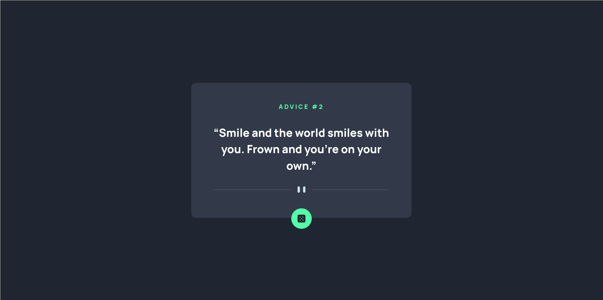

# Frontend Mentor - Advice generator app solution

This is a solution to the Advice generator app challenge on Frontend Mentor. Frontend Mentor challenges help you improve your coding skills by building realistic projects.

## Table of contents

- [Overview](#overview)
  - [The challenge](#the-challenge)
  - [Screenshot](#screenshot)
  - [Links](#links)
- [My process](#my-process)
  - [Built with](#built-with)
  - [What I learned](#what-i-learned)
  - [Continued development](#continued-development)
  - [Useful resources](#useful-resources)
- [Author](#author)

## Overview

### The challenge

Users should be able to:

- View the optimal layout for the app depending on their device's screen size
- See hover states for all interactive elements on the page
- Generate a new piece of advice by clicking the dice icon

### Screenshot

### Links

- Solution URL: [Solution URL](https://github.com/sideedgetech/Advice-Generator)
- Live Site URL: [Live Site URL](https://advising.app.vercel.app)

## My process

### Built with

- [React](https://reactjs.org/) - JS library
- [Vite](https://nextjs.org/) - Frontend Tooling
- [Tailwindcss](https://tailwindcss.com/) - CSS Framework
- [Jotai](https://jotai.org/) - State management

### Useful resources

- [Tailwind Docs](https://tailwindcss.com/docs)

## Author

- [Side Edge] (github.com/sideedgetech)
